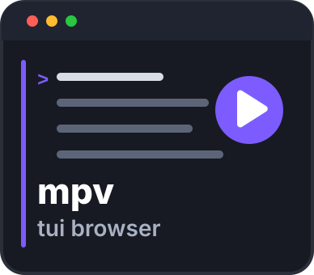

<p align="center">
  
</p>

# `mpv-tui-browser`

[](./LICENSE)

A lightweight terminal file browser for music played by [`mpv`](https://mpv.io), with cover art in terminals with image support (currently Ghostty and kitty).

Browsing a music library:

```text
                      mpv-tui-browser
         Lightweight terminal file browser for mpv
Example Band - Discography/
[2010] Copper Skies/
[2012] Lantern Year/
[2014] First Light/
[2016] Paper Rivers/
[2018] Quiet Engines/
[2020] Northern Hours/
[2022] Glass Harbor (Deluxe Edition)/
[2024] Late Signals/
Search music...
▶ [2010] Copper Skies/01 - Opening Lines.mp3  0:13 / 3:34
```

Inside an album:

```text
                      mpv-tui-browser
         Lightweight terminal file browser for mpv
Example Band - Discography/[2010] Copper Skies/
../
01 - Opening Lines.mp3
02 - Copper Skies.mp3
03 - Salt and Static.mp3
04 - Paper Kites.mp3
05 - Northbound.mp3
06 - Small Machines.mp3
07 - Lantern Light.mp3
08 - Harbor Song.mp3
09 - Slow Weather.mp3
10 - Glass and Iron.mp3
11 - Night Ferry.mp3
12 - Closing Lines.mp3
Search music...
▶ [2010] Copper Skies/04 - Paper Kites.mp3  0:03 / 6:02
```

Requires `mpv` (tested with 0.41.0), and macOS or Linux with `curl`.

## Install

Download the script (it is loaded through an alias, not the `mpv` scripts folder, because it forces `vo=null`):

```sh
mkdir -p ~/.local/share/mpv-tui-browser && curl -fsSL -o ~/.local/share/mpv-tui-browser/mpv-tui-browser.lua https://raw.githubusercontent.com/silvioprog/mpv-tui-browser/main/mpv-tui-browser.lua
```

Add the `mpvb` alias (use `~/.bashrc` instead of `~/.zshrc` for bash):

```sh
echo "alias mpvb='mpv --script=$HOME/.local/share/mpv-tui-browser/mpv-tui-browser.lua'" >> ~/.zshrc && source ~/.zshrc
```

## Usage

```sh
mpvb "/path/to/music"
```

Missing album covers are fetched from MusicBrainz by default and saved as a hidden `.folder.jpg` in the album's folder, so later runs load them without downloading. A cover for a folder that can't be written is kept only until the player closes. To turn that off:

```sh
mpvb --script-opts=mpv-tui-browser-online_covers=no "/path/to/music"
```

Keys: <kbd>↑</kbd>/<kbd>↓</kbd> select, <kbd>Enter</kbd> opens a folder or plays a track, <kbd>Space</kbd> pauses (or plays the selected item), <kbd>Esc</kbd> clears the search or goes back, any other key searches, <kbd>Ctrl</kbd>+<kbd>C</kbd> quits.

## License

`mpv-tui-browser` is available under the [MIT License](./LICENSE).
